# NBA Player Tracker

__Membres de l'équipe__ : `Bourquenoud Nathan`, `Hirschi Laurent` et `Pasquier Benjamin`

L'application est déployée sur Heroku et accessible à l'adresse suivante : [https://nbaplayertracker.herokuapp.com/](https://nbaplayertracker.herokuapp.com/)

Si l'application n'est plus accessible, il suffit de suivre les instructions du fichier README du dossier `code` pour lancer l'application en local.

## 1. Introduction

La National Basketball Association a été créée en 1946, sous le nom de Basketball Association of America avant d'être renommée en 1949. Jusqu'à aujourd'hui, cette ligue a évolué dans de nombreux aspects, les attentes des entraîneurs ou des directeurs sportifs ont donc également changé. Par exemple, l'arrivée de la ligne à trois points dans les années 80 a changé le jeu à jamais, au point que l'habilité des joueurs aux tirs à trois points demeure aujourd'hui une des compétences les plus recherchées. Les salaires ont également augmenté drastiquement et il est aujourd'hui difficile de juger si un joueur est payé de manière adéquate par rapport à ses performances. Ce projet a donc pour but de visualiser les caractéristiques des joueurs NBA selon différents angles afin d'envisager des achats, des ventes ou des transferts qui permettraient d'améliorer l'équipe de l'entraîneur ou du directeur sportif.

## 2. Choix des données

La NBA enregistre un très grand nombre de statistiques durant les matchs disputés mais également toutes sortes d'informations concernant les joueurs et les équipes. Ces données se trouvent sur le [site web officiel](https://www.nba.com/) de la NBA et peuvent être accessibles via des APIs. Étant donné qu'il existe des sources de données plus simples à manipuler, cette API n'est pas directement utilisée. Dans le cadre de ce projet, les données sources de données suivantes sont utilisées :
* L'[API Python](https://github.com/swar/nba_api) proposé sur Github par l'utilisateur [swar](https://github.com/swar), permettant d'accéder facilement aux APIs du site officiel de la NBA et donc de toutes les données qu'il contient.
* Les données salariales du site [basketball-reference.com](https://www.basketball-reference.com/contracts/players.html) qui contient les salaires de tous les joueurs actuels de la NBA.

L'évolution du salaire des joueurs étaient également prévue comme visualisation mais nous n'avons pas trouvé de source de données contenant les salaires des joueurs durant les années précédentes (sans avoir à les récupérer en faisant du scraping). Nous avons donc décidé d'inclure uniquement les salaires actuels des joueurs.

### 2.1 Constitution des données finales

Les données récupérées sont traitées et structurées afin d'être utilisées facilement par l'application web. Elles sont stockées dans des fichiers au format JSON ou CSV. La base de données constitées contient des informations de 128 joueurs actuels de la NBA, qui ont été choisies en fonction de leurs performances au cours de la saison actuelle (2021-2022). Bien entendu, nous aurions pu inclure tous les joueurs actuels de la NBA, mais dans le cadre de ce projet, nous avons décidé de limiter la taille de notre base de données afin de pouvoir travailler plus facilement avec les données. Plus précisément, les données de ces joueurs sont donc les suivantes :
- __Les informations statiques à chaque joueur__ (nom, prénom, date de naissance, taille, poids, poste, équipe actuelle, salaire actuel, etc.). Un score de performance a été calculé pour chaque joueur qui se base sur ses statistiques durant la saison actuelle. Ce score est calculé en prenant compte le nombre de points, d'assistances, de rebonds, de contres, d'interceptions, de balles perdues et de l'habilité aux tirs. Ce score est ensuite normalisé afin de pouvoir comparer les joueurs entre eux.
- __Les stastiques des joueurs pour chaque saison__ (points par match, rebonds par match, assistances par match, habilité aux tirs, etc.).
- __La localisation des tirs pour chaque joueur et chaque saison__. Pour chaque joueur, le nombre de tirs marqués et effectués à chaque localisation du terrain (51*48 localisation) est enregistré, par saison.

## 3. Technologies utilisées

Ce projet est réalisé sous la forme d'application web, avec une partie frontend pour la visualisation de l'information et une partie backend pour la gestion des données. Les technologies utilisées sont les suivantes :

* __[Python](https://www.python.org/)__ : language de programmation utilisé pour le traitement des données et la création d'une interface entre le frontend et les fichiers de données. Il est également utilisé pour la création de l'application web avec Dash.
* __[Dash](https://plotly.com/dash/)__ : librairie Python qui permet de créer rapidement des applications web interactives de visualisation et d'analyse de données à l'aide de code Python. Il est construit sur la bibliothèque Plotly.js et utilise le framework Flask pour servir les pages web et exécuter le code Python.
* __Autres libraries Python__ : principalement [Pandas](https://pandas.pydata.org/) pour le traitement des données, [Numpy](https://numpy.org/) pour le calcul scientifique et [Jupyter Notebook](https://jupyter.org/) pour la création de notebooks pour le traitement des données.

## 4. Intention et public cible

L'objectif de ce projet est de permettre à des entraîneurs et/ou des directeurs sportifs d'équipe de la NBA de chercher et trouver des joueurs évoluant dans la ligue qui correspondent au mieux à leurs attentes. La réalisation de ce projet leur permet de naviguer parmi tous les joueurs de la ligue et de les comparer selon plusieurs critères (statistique particulière, salaire, performance globale, localisation des tirs du joueur) afin de trouver la ou les pièce(s) manquante(s) de leur équipe. 

L'application développée est composée donc de plusieurs visualisations de données permettant à des entraîneurs et directeurs sportifs de la NBA de trouver efficacement les joueurs qui correspondent le mieux à leurs attentes.

## 5. Choix des représentations

L'interface de notre application interactive est composé de différentes représentations. Elle est composée de deux parties principales :
- Une partie supérieure contenant une représentation globale des données dans un tableau,
- Une partie inférieure contenant plusieurs représentations plus détaillées des données.

### 5.1 Vue globale

La partie supérieure de l'application contient une représentation globale des données dans un tableau. Elle offre un premier aperçu des informations et des statistiques des joueurs qui peuvent être représentées textuellement. Ce tableau est représenté par l'image ci-dessous.

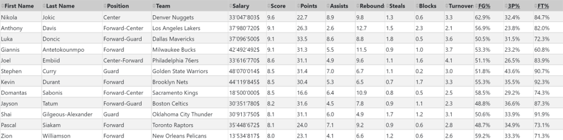

<h5 align="center">Tableau représentant les données globalement</h5>
 

Toutes les données de ce tableau sont statiques. Les premières colonnes contiennent les informations générales des joueurs (nom, prénom, date de naissance, taille, poids, poste, équipe actuelle, salaire actuel, etc.) et les colonnes suivantes contiennent les statistiques des joueurs durant la dernière saison. Le tableau offre donc une vue globale et actuelle des informations et statistiques des joueurs.
Les valeurs contenues dans chaque colonne peuvent être triées par ordre croissant ou décroissant, permettant ainsi de privilégier ou non certains critères de recherche.

### 5.2 Comparaison des joueurs

La partie inférieure de l'application contient plusieurs représentations plus détaillées des données. Elle permet de comparer deux joueurs entre eux selon plusieurs critères et plusieurs représentations. Cette partie est dynamique et donc premièrement composée d'un slider qui permet de sélectionner les saisons prises en compte.

#### 5.2.1 Cartes comparatives

La première représentation est construite sous forme de deux cartes permettant de comparer numériquement les statistiques de deux joueurs. Chaque carte contient une partie supérieure statique, composée des informations générales du joueur en plus de sa photo, et une partie inférieure dynamique, composée des statistiques du joueur selon les saisons sélectionnées. Elles sont représentées par l'image ci-dessous.

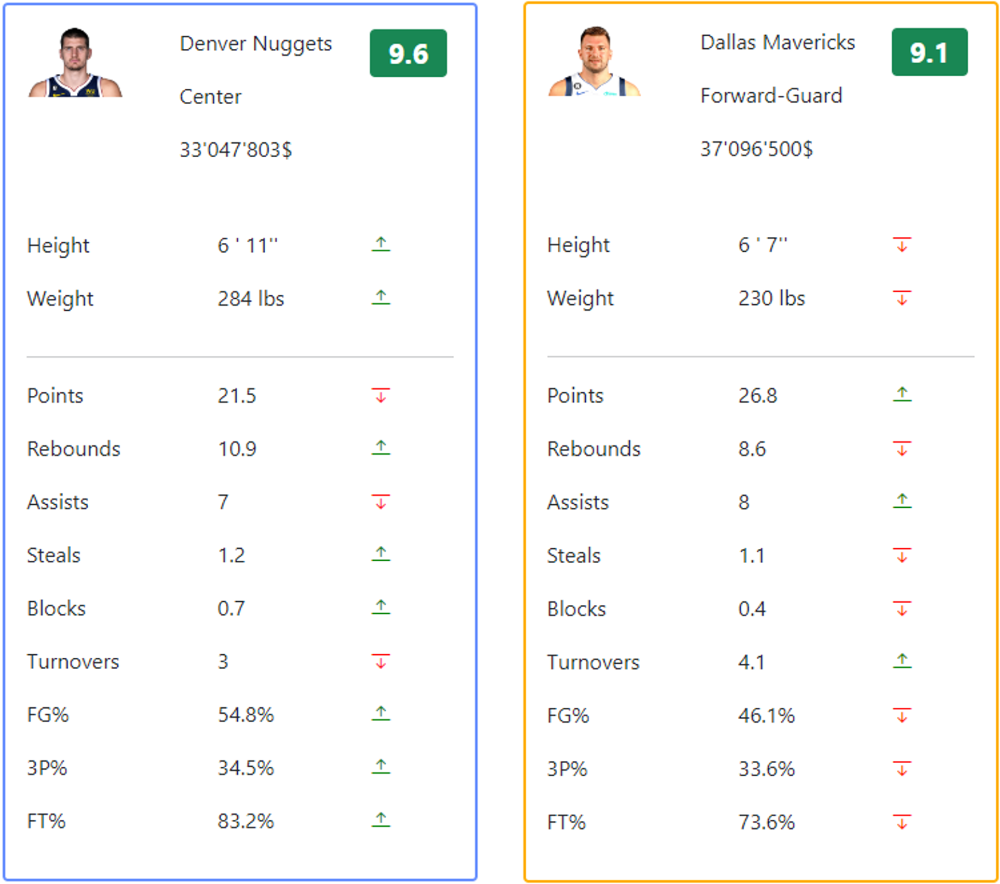

<h5 align="center">Deux cartes pour deux joueurs différents permettant la comparaison des statistiques</h5>
 

Ces cartes permettent de se concentrer sur les statistiques de deux joueurs spécifiques et de les comparer rapidement à l'aide d'indicateurs visuels (flèches vertes ou rouges).

#### 5.2.2 Heatmap des tirs

La deuxième représentation est constituée de deux scatterplot construites de manière à représenter une heatmap des tirs tentés et réussis par chacun des deux joueurs comparés. Cette représentation permet de visualiser la localisation des tirs des joueurs sur une moitié de terrain de basket-ball. Elle est composée de deux informations :
- la couleur de chaque point représente le pourcentage de réussite du joueur à cet endroit du terrain,
- la taille de chaque point représente le nombre de tirs tentés par le joueur à cet endroit du terrain.
Le scatterplot est représenté par l'image ci-dessous.

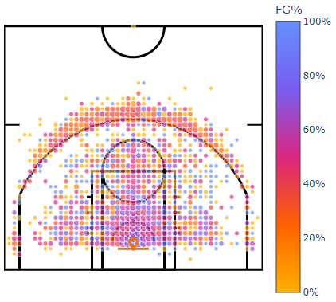

<h5 align="center">Heatmap sous forme de scatterplot pour un joueur spécifique</h5>

Les deux informations représentées permettent de visualiser les zones de prédilection du joueurs puisque les zones dans lesquelles le joueur est le plus habile formeront un groupe de points de couleur similaire et les zones où les joueurs tentent le plus de tirs formeront un groupe de points de taille similaire. Les principes de groupement de la théorie de la Gestalt telles que la similarité (points de même couleur ou de même taille) et la proximité (les clusters formant une zone de tirs sont éloignées les une des autres) sont utilisés dans cette représentation.

Comme les écarts des tirs tentés aux différents endroits peuvent être très importants (pour la plupart des joueurs, la majorité des tirs sont tentés dans la raquette, donc proche au panier), la taille des points est normalisée afin de pouvoir comparer les joueurs entre eux. La normalisation est réalisée en calculant le logarithme de base naturelle du nombre de tirs tentés à cet endroit du terrain. De cette manière, les points ne se chevauchent pas entre eux et les différences de taille sont tout de même visibles.

#### 5.2.3 Line chart

La dernière représentation est un line chart qui représente l'évolution d'une certaine statistique des deux joueurs comparés au cours des saisons sélectionnées. Le linechart est donc composée de deux courbes, de deux couleurs différentes, représentant l'évolution de la statistique en question pour chacun des deux joueurs. Cette représentation est représentée par l'image ci-dessous.

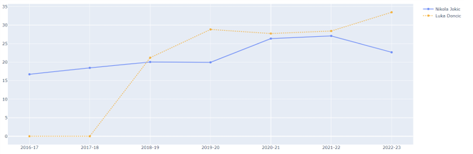

<h5 align="center">Line chart pour deux joueurs différents, selon le nombre de points par match</h5>

Cette représentation permet de visualiser la tendance des performances des joueurs selon une statistique. Elle permet de voir si un joueur particulier progresse, ou au contraire, s'il stagne ou régresse. Elle permet également de comparer la progression de deux joueurs entre eux.

## 6. Présentation et interaction

La structure de l'interface est réalisé de manière à observer plusieurs niveaux de granularité de l'information, avec les deux parties mentionnées précédemment. De plus, des choix ont également été fait au niveau des couleurs ainsi que des fonctionnalités d'interactions fournies à l'utilisateur.

### 6.1 Présentation

L'interface réalisée est construite de manière verticale. Les données globales de tous les joueurs se situent en haut de la page et offrent un aperçu rapide des informations et statistiques des joueurs. La partie inférieur de l'interface sert à analyser en détail deux joueurs qui sont comparés. Le but de cette présentation des données et de permettre à l'utilisateur dans un premier de temps de trouver rapidement des joueurs qui correspondent à ses critères de recherche (une information générale sur le joueur, une statistique, etc.) puis d'analyser ces joueurs en détails, avec l'opportunité de les comparer pour trouver la pièce manquante à son équipe. Nous avons donc une granularité de l'information qui va de l'information globale à l'information détaillée, chaque représentation étant construite pour répondre à un besoin spécifique de l'utilisateur :
- le tableau de données globales permet de trouver rapidement des joueurs qui correspondent à des critères de recherche, il permet donc de réaliser un premier tri,
- les cartes des joueurs permettent de comparer rapidement et numériquement les statistiques de deux joueurs, selon une certaine période,
- les scatterplots permettent de se concentrer spécifiquement sur la localisation des tirs des deux joueurs, selon une certaine période,
- le line chart permet de comparer une statistique choisie par l'utilisateur des deux joueurs sur plusieurs saisons, selon une certaine période.

Cette granularité est représentée par l'image ci-dessous.

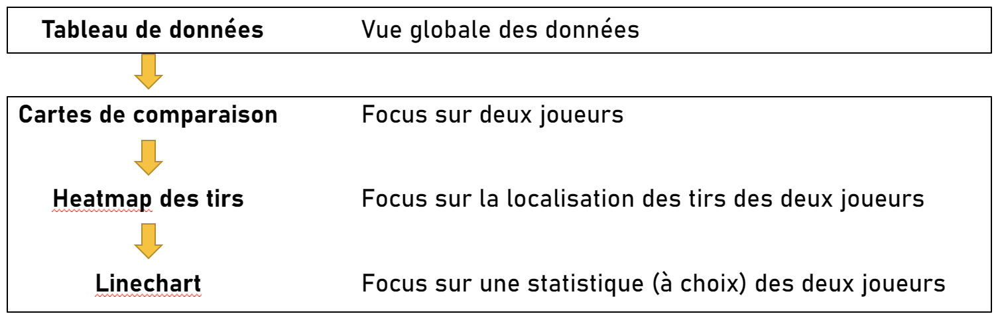

<h5 align="center">Granularité de l'information au sein de l'interface</h5>

#### 6.1.1 Choix des couleurs

Le choix des couleurs est également important, principalement pour permettre à la majorité des utilisateurs de distinguer les informations mais également pour donner une information complémentaire sur les données. 

Sur les cartes comparatives, un score y est associé représentant les performances globales du joueur lors de la saison actuelle. Afin de permettre une comparaison rapide de ces performances, le score est associé à une couleur. Trois couleurs sont utilisés, rouge, orange et vert, qui sont trois couleurs courantes pour représenter des niveaux de performances (mauvais, moyen, bon). Un exemple est présenté par l'image ci-dessous, avec un exemple pour chaque niveau de performance.

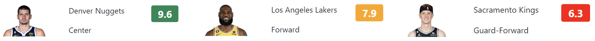

<h5 align="center">Exemples de scores et de leur couleur associée</h5>

Sur ces mêmes cartes, les informations et statistiques numériques sont suivies d'une flèche, qui indique si la valeur est supérieure ou inférieure à celle du joueur comparé. Pour renforcer cette idée, les flèches sont de couleurs différentes selon que la valeur est supérieure ou inférieure. Les flèches sont donc de couleur verte si la valeur est supérieure, et de couleur rouge si la valeur est inférieure. Un exemple est présenté par l'image ci-dessous.

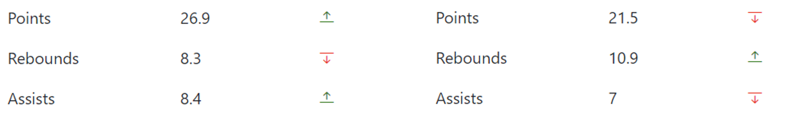

<h5 align="center">Exemple des valeurs de deux cartes de joueurs comparés</h5>

La heatmap est également colorée puisque la couleur des points représente l'habilité du joueur à marquer un panier depuis la position correspondante. Comme les points sont nombreux et qu'ils forment différentes zones de couleurs différente, il est important de pouvoir les distinguer. Nous avons donc choisi une palette de couleur qui permet à la majorité des utilisateurs, quel que soit leur problème de vision, de distinguer les différentes zones de couleurs. Le résultat est présenté par l'images ci-dessous, avec un exemple pour certains types de daltonisme.

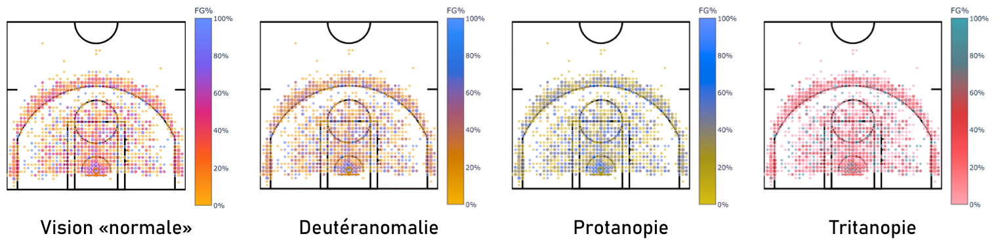

<h5 align="center">Exemples de la heatmap avec différents types de daltonisme</h5>

À l'aide de cette palette, les valeurs limites sont très différenciables, et les valeurs intermédiaires peuvent également être suffisamment distinguées.

Finalement, la linechart possédant deux courbes, nous avons décidé d'utiliser les mêmes couleurs que les deux couleurs représentant les valeurs limites du pourcentage aux tirs de la heatmap. Il s'agit donc de bleu et de jaune orangé. Pour renforcer la distinction (par exemple pour des personnes qui ne voient qu'en niveau de gris), une courbe est en pointillés et l'autre en pleine ligne. L'image ci-dessous présente un exemple de linechart ainsi que les deux couleurs utilisées et leur perception par les personnes atteintes de différents types de daltonisme.

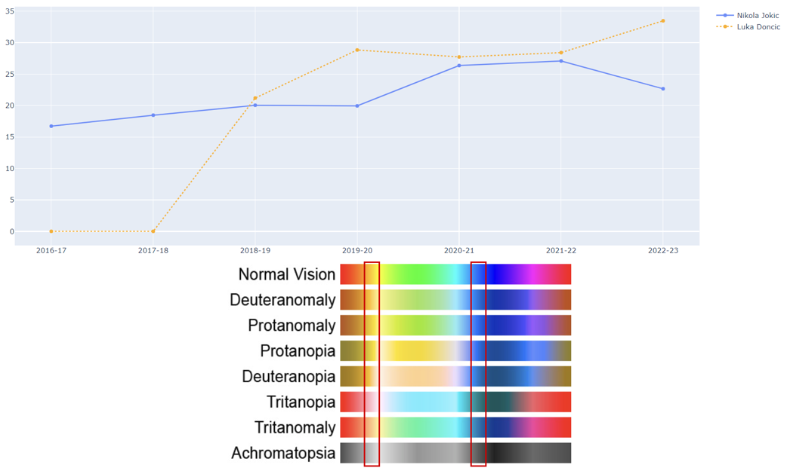

<h5 align="center">Exemple d'une linechart et la perception selon différents types de daltonisme</h5>

### 6.2 Interaction

Chacune de nos représentations sont interactives, à des niveaux différents. L'interaction principale est la possiblité d'afficher les données selon une période de temps. Nos interactions suivent relativement le Mantra de la visualisation de l'information, composé des étapes suivantes :
- __Overview first__ : Le tableau de données est affiché en haut de la page et représente une vue d'ensemble des données.
- __Zoom and filter__ : L'utilisateur ne peut pas zoomer sur les représentations (hormis sur le linechart et ce n'est pas forcément très utile), mais peut filtrer sur une période de temps et sur des joueurs à analyser et comparer.
- __Details on demand__ : L'utilisateur peut scroller sur la page pour explorer les représentations détaillant les données qu'il souhaite analyser. Il peut également survoler les éléments de la représentation pour obtenir des informations supplémentaires.

La granularité mentionnée précédemment dans la structure de la page se retrouvent donc également dans les interactions.

#### 6.2.1 Tri des données tabulaires (reconfigurer)

Le tableau de données est triable selon chacune des colonnes. Le tri est effectué en cliquant sur le nom de la colonne. Un premier clic trie la colonne de manière croissante, un second de manière décroissante. Il permet à l'utilisateur de privilégier un critère (une information ou une statistique) lors de la recherche d'un joueur. Cette fonction de tri est illustrée par l'image ci-dessous.

    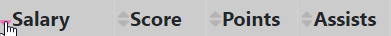

<h5 align="center">Exemple d'une possibilité de tri du tableau, ici la colonne des salaires</h5>

#### 6.2.2 Sélection de la période de temps (filtrer)

Les données affichées dans les représentations de comparaison sont modifiées en fonction de la période de temps sélectionnée. Les unité de temps correspondent aux saisons NBA (2012-13, 2013-14, etc.), qui sont comprises entre la saison 2012-13 à la saison actuelle (2022-23). La période de temps est sélectionnée par un slider qui est situé en haut de la partie inférieure de l'interface. Le slider est composé de deux curseurs, un pour la période de début et un pour la période de fin. Il est représenté par l'image ci-dessous.

    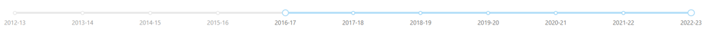

<h5 align="center">Slider permettant de sélectionner les saisons à analyser</h5>

Lors de sa mise à jour, les données de chacune des représentations de la partie de comparaison de l'interface (c'est-à-dire les cartes, les scatters plots et le line chart) sont mises à jour en fonction de la période de temps sélectionnée.

#### 6.2.3 Sélection des joueurs à comparer (filtrer)

Le nom des joueurs affichés dans leurs cartes est un dropdown menu dans lequel il est également possible de taper le nom du joueur recherché. Cela permet à l'utilisateur de trouver rapidement le nom du joueur qu'il souhaite comparer (en ayant typiquement en amont déjà trouvé le nom du joueur grâce au tableau de données). Ce menu est illustré par l'image ci-dessous.

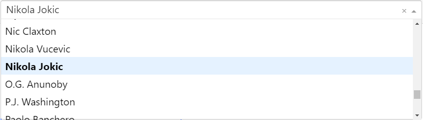

<h5 align="center">Menu dropdown permettant de sélectrionner le premier joueur</h5>

Au démarrage de l'application, deux joueurs sont déjà sélectionnés, il s'agit simplement des premiers joueurs selon un tri sur le prénom. À chaque fois que la sélection dans le dropdown menu est mise à jour, les cartes des joueurs ainsi que les scatterplots et le line chart sont mis à jour avec les données des joueurs sélectionnés.

#### 6.2.4 Survol des points (élaborer)

Lorsque l'utilisateur survole un point sur un scatterplot, le point est mis en évidence et données précises des tirs pour la localisation en question sont affichées dans un tooltip. Le tooltip est composé de trois informations :
- le pourcentage de réussite des tirs (FG%),
- le nombre de tirs tentés (FGA),
- le nombre de tirs réussis (FGM).

Le comportement est le même pour linechart, qui fournit une information précise sur la valeur de la statistique. Ce survol est illustré par les images ci-dessous.

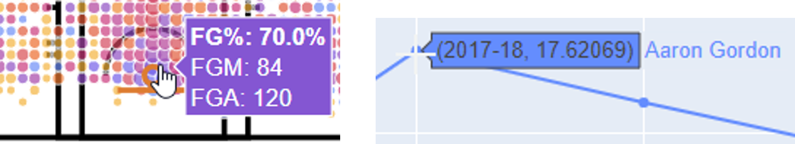

<h5 align="center">Survol respectivement d'un point du scatterplot et d'un point du linechart</h5>

Cette interaction est particulièrement utile dans le cas des scatterplots, puisqu'elle permet à l'utilisateur d'avoir s'il le souhaite des informations plus précises sur les tirs des joueurs, sans pour autant péjorer la lisibilité de la représentation.

#### 6.2.5 Choix de la statistique à comparer dans le linechart (filtrer)

Le line chart permet l'évolution d'une statistique de deux joueurs sur une certaine période. La statistique à analyser et comparer dans le temps est sélectionnée par l'utilisateur, en cliquant sur le boutonc orrespondant. Les boutons sont situés au dessus du line chart, et sont illustrés par l'image ci-dessous.

    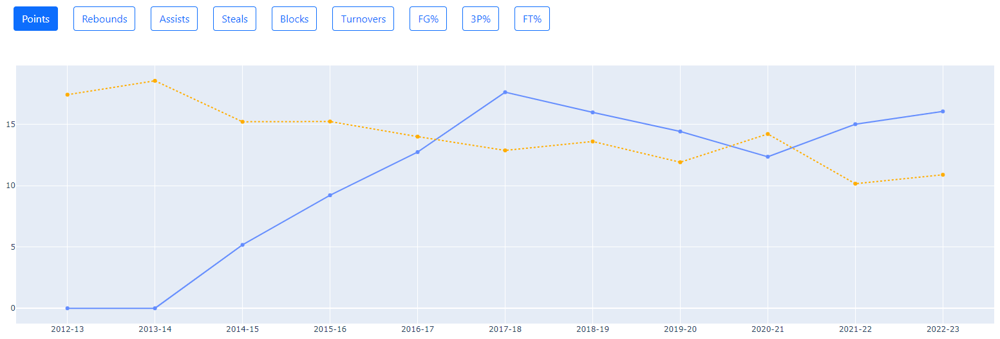

<h5 align="center">Linechart avec les boutons de sélection de la statistique au dessus. Ici l'analyse est faite en fonction des points des joueurs</h5>

 Cela permet à l'utilisateur de se focaliser sur une statistique particulière, et de comparer les joueurs dans le temps en fonction de celle-ci.

## 7. Critique des outils utilisés

Tout l'application a été développée en utilisant le framework Python Dash. Ce framework étant particulièrement adapté à la création d'application web de visualisation de données, la réalisation de notre projet a été grandement facilitée et accélérée. Cependant, cette facilité d'utilisation a un coût, puisqu'il est difficile de personnaliser certains composants et donc d'implémenter des comportements spécifiques à l'utilisation que nous voulions en faire.

En effet, nous voulions par exemple implémenter la possibilité d'ajouter des joueurs dans la comparaison en cliquant sur un bouton contenu dans le tableau de données, afin de renforcer l'idée que ce tableau sert de point de départ en amont de la comparaison. Avec Dash, il semblait difficile d'implémenter ce comportemnet et avons donc été contraint d'opter pour une utilisation plus classique avec un dropdown menu.

Notre application étant composé de visualisations de données assez classiques, nous n'avons pas eu des besoins conséquents de personnalisation et le choix de cette technologie s'est donc avéré judicieux et pertinent. Il est aussi important de noter qu'elle était nouvelle pour nous, et qu'avec un peu plus d'expérience, nous aurions pu certainement l'utiliser de manière plus efficace. La librairie Plotly.JS possède en effet de grandes quantité de visualisations, et nous aurions certainement pu en utiliser certaines pour illustrer nos données. Un radar chart aurait par exemple été utile pour illustrer encore mieux le profil des joueurs (un joueur est-il plutôt un offensif ou défensif ?). Notre application étant single page, une quantité trop importante de visualisations aurait cependant pu rendre l'application difficile à utiliser, il aurait donc fallu également réfléchir à une manière sensée de séparer les représentations en plusieurs pages.

Concernant l'utilisation de Python et de Notebook pour le traitement et la création des données, ce choix a été tout à fait légitime puisque nous avons l'habitude de travailler avec ces outils, et qu'ils permettent de réalisser des traitements rapidement, en visualisant les modifications faites sur les données.

## 8. Conclusion

En conclusion, l'application développée est fonctionnelle et les représentations utilisées font sens puisqu'elle répondent chacune à besoin spécifique qu'un entraîneur ou directeur sportif peut avoir lorsqu'il veut signer un nouveau joueur dans son équipe. Nous pensons donc que l'utilité de notre application est réelle, et qu'elle pourrait, après quelques améliorations, être utilisée par des équipes professionnelles de basket-ball.

Ces améliorations concernent principalement la GUI dans son ensemble, puisque notre application est très peu responsive et qu'elle ne s'adapte pas très bien à certaines tailles d'écran (c'est pas exemple le cas si l'application est ouverte sur un smartphone). Le positionnement des différents composants et représentations pourraient également être améliorés, de même que pour la structure de l'application (par exemple utilisé plusieurs pages ou un menu de navigation).

Hormis ces points à améliorer, l'objectif de ce projet est atteint puisque nous avons mis en place une application interactive et que certains concepts vus en cours ont été mis en pratique. Nous avons également pu nous familiariser avec le framework Dash, qui est un choix très intéressant lors du développement d'application web de visualisation de données. Finalement, nous sommes donc satisfaits de notre projet et avons pris beaucoup de plaisir à le réaliser.